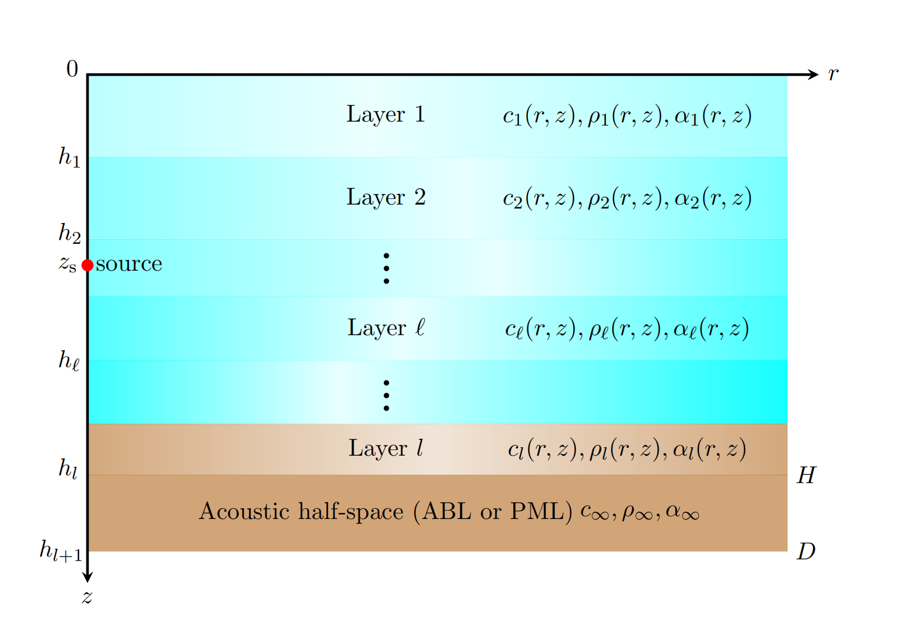

# SMPE
A spectrally discretized wide-angle parabolic equation model for simulating acoustic propagation 
in laterally inhomogeneous oceans

**`SMPE_readme`, Jun. 27, 2023, Houwang Tu, Ph.D candidate of NUDT**

The program `SMPE.m`compute the laterally inhomogeneous acoustic field in Fig.1 using the 
Chebyshev-Tau spectral method. 

`SMPE.m` were originally developed as part of the author's articles (H. Tu, Y. Wang, X. Ma et al., Applying the 
Chebyshev-Tau spectral method to solve the  parabolic equation model of wide-angle rational 
approximation in ocean acoustics, Journal of Theoretical and Computational Acoustics, 2021, 
https://doi.org/10.1142/S2591728521500134 and Y. Wang, H. Tu, W. Liu et al., Application of 
a Chebyshev Collocation Method to Solve a Parabolic Equation Model of Underwater Acoustic 
Propagation, Acoustics Australia, 2021, https://doi.org/10.1007/s40857-021-00218-5)

In 2023, we extended this model to be able to solve inhomogeneous oceans with any number of layers. 
Please refer to (H.Tu,Y.Wang,Y.Zhang et al.,A spectrally discretized wide-angle parabolic equation 
model for simulating acoustic propagation in laterally inhomogeneous oceans, The Journal of Acoustical 
Society of America, 2023, https://doi.org//10.1121/10.0019748) for details.

`SMPE.m` uses the input file "`input_SMPE.txt`", '`ReadEnvParameter`' function is used to read 
"`input_SMPE.txt`" file. User can make changes to "`input_SMPE.txt`" for the desired calculation. 

The "`input_SMPE.txt`" file contains the parameters defining the calculation. 
See the following example:

```
Idealfluid                               ! casename
1                                        ! Layers (number of layers)
8                                        ! np (term of pade approximation)
1                                        ! ns (stability constraints for self-starter)
1500                                     ! c0 (reference sound speed)
20                                       ! freq (frequency of source)
40                                       ! zs (depth of source)
40                                       ! zr (depth of special receiver)                                                                              
2500.0                                   ! rmax (receiver ranges(m))
5                                        ! dr (discrete step in horizontal direction)                                      
150                                      ! depth (depth of ocean)
0.5                                      ! dz (discrete step in depth direction)
50                                       ! Coll (truncation orders of spectral method)
40                                       ! tlmin (minimum value of TL in colorbar)
70                                       ! tlmax (maximum value of TL in colorbar)
1                                        ! N (number of sound speed profiles)
0                                        ! range (ranges of sound speed profiles)
30                                       ! n (profiles' points in ocean)
0.00  1480.65   1.0   0.0                ! dep  c  rho  alpha 
5.79  1480.80   1.0   0.0
12.06 1481.01   1.0   0.0
19.78 1480.94   1.0   0.0
27.01 1481.16   1.0   0.0
35.21 1481.30   1.0   0.0
37.62 1480.36   1.0   0.0
40.51 1479.06   1.0   0.0
45.82 1475.15   1.0   0.0
47.75 1473.70   1.0   0.0
49.68 1472.68   1.0   0.0
53.54 1471.88   1.0   0.0
56.91 1470.80   1.0   0.0
60.29 1469.78   1.0   0.0
65.60 1468.91   1.0   0.0
72.35 1468.91   1.0   0.0
78.62 1468.62   1.0   0.0
84.41 1467.61   1.0   0.0
89.23 1467.97   1.0   0.0
93.09 1468.84   1.0   0.0
96.95 1468.26   1.0   0.0
99.84 1467.54   1.0   0.0
104.18 1466.81  1.0   0.0
109.49 1466.23  1.0   0.0
113.83 1466.45  1.0   0.0
119.61 1466.59  1.0   0.0
125.40 1466.67  1.0   0.0
130.71 1466.74  1.0   0.0
138.42 1466.67  1.0   0.0
150.00 1466.88  1.0   0.0
V                                        ! lower boundary condition
```

The "`input_SMPE.txt`" file include:

* `casename` is the name of current example,

* `Layers' is the layers of media,

* `np` is the number of items used for the rational approximation; the choice will also affect
   the accuracy of the approximation. More precisely, it is determined by the user according
   to the complexity of the research environment and the characteristics of the sound source. 
   
* `ns' is the stability constraints of self-starter,

* `c0' is the reference speed,

* `freq` (frequency of sound source, Hz), 

* `zs` (the depth of source, m), 

* `zr` (depth of a special receiver, user used to specify to draw the transmission loss curve of
  arbitrary depth, m), 

* `rmax` (the maximum range of horizontal direction, m), 

* `dr` (horizontal discrete step, m),

* `depth` (depth of ocean, m),

* `dz` (discrete step size in depth direction, m),

* `Coll` (the numbers of truncated orders), the number of `Coll' corresponding to 
   the number of layers,

  Generally speaking, the more complicated the shape of the sound speed profile, 
  the more `Coll` and is needed to accurately fit.

* `tlmin`
  and `tlmax` are the minmum and maximum value transmission loss,
  respectively, which used to determine the color range of the output
  transmission loss graph, `tlmin` must less than `tlmax`.
  
* `N' is the number of sound speed profiles,

* `depth' are the interfaces of media,

* `range' are the ranges of updating sound speed profiles,

* `n` is the amount of environmental profile data in ocean. 

  The following is a table of environmental parameter: the units are depth(m), speed(m/s),
  density(gm/cm$^3$) and attenuation (dB/wavelength)

    

  Figure 1. Laterally inhomogeneous marine environment.